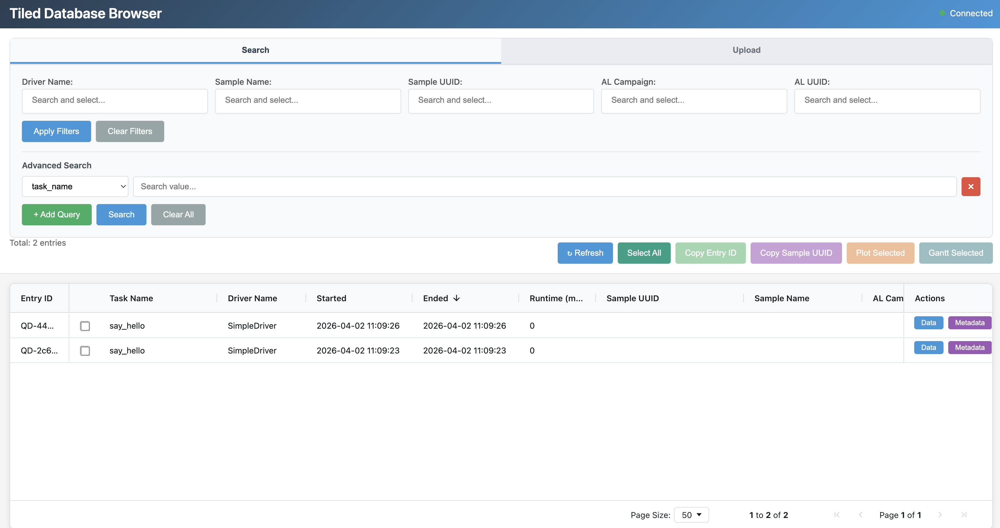

======================
Using Tiled Server
======================

Tiled is a Python-based data server developed by Bluesky/NSLS-II that serves structured scientific data (arrays, dataframes, etc) via HTTP. It is designed to help scientists store, access, and find scientific data at scale and supports parallel uploads and downloads for efficient transfers. 

Installation
----------------
To install Tiled Server, you can use pip:

.. code-block:: bash

    pip install tiled

Setting up Tiled Server
----------------
To set up Tiled Server, you need to access AFL's tiled configuration file (AFL-automation/tiled/config.yml) that specifies the data sources and other settings. 

**CORS**: Cross-Origin Resource Sharing (CORS) is a browser security rule that blocks web pages from making requests to a different domain or port than the one they were loaded from. Since AFL's frontend runs on a different port than Tiled (port 5000 vs. port 8000), you need to explicitly tell Tiled which origins are allowed to talk to it, otherwise the browser will block the connection. 

Without configuring the origin, it is still possible to connect to the database, and the Tiled will route traffic through a same-origin proxy 

This is not an error, but it means Tiled is proxying the connection rather than serving it directly, which can affect API key handling and performance. 

To avoid this, you need to add the AFL frontend's origin (http://localhost:5000) to the allow_origins list in the tiled/config.yml file.

1. In the terminal, run the command below to generate the API key:

.. code-block:: bash

    openssl rand -hex 32

2. Open the `tiled/config.yml` file and add the generated API key under the authentication section:

.. code-block:: yml
    
    authentication:
        single_user_api_key: [your_api_key_here]

3. Make sure the following line is also included in the same config.yml file:

.. code-block:: yml
    
    allow_origins:
        - http://localhost:5000

4. After the config file is updated with the correct origin and API key, run the command below to start the Tiled Server:

.. code-block:: bash

    tiled serve config AFL-automation/tiled/config.yml

You have now successfully started the Tiled Server.

Starting the API Server
-----------------
5. After starting the Tiled Server, before running the Driver file, add the following details to ~/.afl/config.json file:

.. code-block:: json

    {
        "tiled_server": "http://localhost:8000",
        "tiled_api_key": "your_api_key_here"
    }

**Note**: the api_key in the json file should match the one in the tiled/config.yml file

6. Run the Driver file to start the API Server. 

sample command to start the API server with the SimpleDriver file:

.. code-block:: bash
    
    python -m AFL.automation.instrument.SimpleDriver

7. A successful startup will show a confirmation message or accessible URL within the APIServer. The connection message on the top right of the database browser should now say **Connected** instead of **connected via same-origin proxy**

Database Browser
------------------

**Note**: to avoid connect through same-origin proxy, make sure the message on the top right says **Connected** instead of **connected via same-origin proxy**. 
Once the API Server is running, you can access AFL's tiled database browser (typically at http://localhost:5000/tiled_browser)

This interface allows users to display AFL data as browsable nodes and datasets directly in the browser, making it easier to explore and understand the data structure.

Additional Resources
----------------------
- Tiled Server Documentation: https://blueskyproject.io/tiled/index.html  