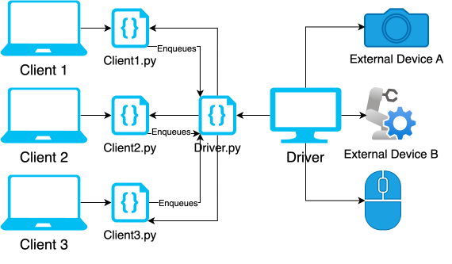
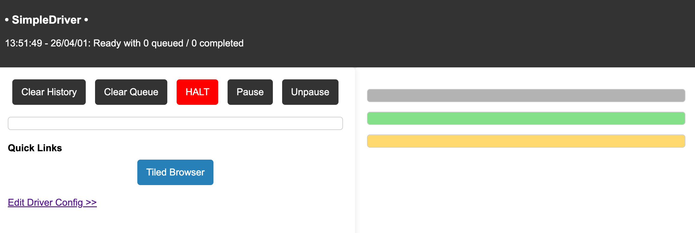
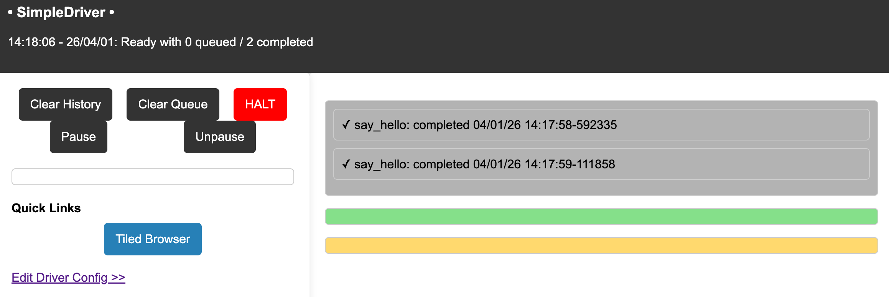

Beginner Guide
==============

This tutorial will guide you through basic examples of using the AFL through use of a raspberry pi. After going through this tutorial, you will learn:

- How to queue basic commands to the AFL and view the results
- How to queue hardware specific commands to the AFL and view the results
- How to set up external devices to be used with the AFL

.. raw:: html

   

Shown above is a top level overview of how the AFL operates. One or multiple clients, each with their own client.py files, send commands through HTTP to a device hosting the driver.py file, which then executes the specified command and returns the result back to the client. 

The following sections will guide through how to setup both the client.py and driver.py files to perform the specified operations, with each section performing slightly more advanced operations than the previous. 

Prerequisites
------------

To fully utilize this tutorial, a USB camera and a raspberry pi with internet access and the AFL installed are required. For how to install the AFL, please see :doc:`Setup <installation>`.

Basic AFL usage
--------------

To get a good understanding of a basic use case of the AFL, consider the starter code given in the :doc:`Quick Start Guide <quick-start>`, which will be referred to as SimpleDriver.py:

.. code-block:: python
    
    from AFL.automation.APIServer.Driver import Driver
    
    class SimpleDriver(Driver):
        defaults = {}
        defaults['greeting'] = 'Hello, World!'
        
        def __init__(self, overrides=None):
            Driver.__init__(self, name='SimpleDriver', 
                           defaults=self.gather_defaults(),
                           overrides=overrides)
        
        def say_hello(self):
            """Say a greeting based on configuration"""
            return self.config['greeting']

    if __name__ == '__main__':
        from AFL.automation.shared.launcher import *

This basic driver allows for a user to query the device the driver is running on, to which the device will return the greeting stored on the disk which is initiated as 'Hello World' on creation.

To run the driver, place the SimpleDriver.py file within the AFL/automation/instrument file and run from the command line:

.. code-block:: bash

    python -m AFL.automation.instrument.SimpleDriver

Doing so will show an output on the CLI that lists the system info, added routes, and the API server starting. With this, you can now view the server located at http://localhost:5000.

This is the default page for the driver that can be used to view the tasks that have been queued and run through the driver which will be displayed on the right hand side as well as commands to operate on the currently running task.

With the driver running, we can now queue a task. To do so, we use the python code given in :doc:`Quick Start Guide <quick-start>`, which will be referred to as Client.py:

.. code-block:: python

    from AFL.automation.APIServer.Client import Client

    # Connect to the service
    client = Client('localhost',port=5000)
    client.login(username = 'user')

    # Call a method
    response = client.enqueue(task_name='say_hello',interactive=True)
    print(response['return_val'])  # Outputs: 'Hello, World!'

    # Call a method asynchronously
    response = client.enqueue(task_name='say_hello',interactive=False)
    print(response)  # Outputs a uuid

In the above code, two separate ways of enqueuing the task say_hello are performed: one that directly returns the result of the task, and one that returns the associated UUID, determined by the interactive flag.

Running the Client.py file on the same device SimpleDriver.py is running on will result in an output of:

.. code-block:: bash

    Hello, World!
    QD-05cdd0ed-6f25-45e6-8d70-1528e9de4064

Viewing the website at http://localhost:5000 now displays that both say_hello tasks were completed:

To change the output of the say_hello task, simply change the default greeting by pressing Edit Driver Config and setting it to whatever your desired output is. This will save the new value to the disk, meaning that even if the AFL is stopped and started again, the greeting will remain whatever you last set it to.

AFL usage with specific hardware
--------------------------------

To gain a better understanding of the capabilities of the AFL, we can have the AFL perform hardware-specific operations. To do so, consider this driver code to be run on a raspberry pi:

.. code-block:: python

    from AFL.automation.APIServer.Driver import Driver
    import subprocess

    class SimpleDriver(Driver):
        defaults = {}
        defaults['greeting'] = 'Hello, World!'

        def __init__(self, overrides=None):
            Driver.__init__(self, name='SimpleDriver',
                        defaults=self.gather_defaults(),
                        overrides=overrides)

        def say_hello(self):
            """Say a greeting based on configuration"""
            return self.config['greeting']
            
        def get_cpu_temp(self):
            """Returns the temperature of the raspberry pi"""
            result = subprocess.run(['vcgencmd', 'measure_temp'], capture_output=True, text=True)
            return(result.stdout)

    if __name__ == '__main__':
        from AFL.automation.shared.launcher import *

As can be seen in the function get_cpu_temp, a raspberry pi command is printed, which obtains the current temperature of the raspberry pi.

It is worth noting that even though we are only using the get_cpu_temp function, the previous functions remain in the driver code. This allows any client connecting to the raspberry pi to call any of the functions that the driver supports, not just get_cpu_temp.

If we run this code on the raspberry pi, we can now query the temperature of the raspberry pi on other devices through this client code:

.. code-block:: python

    from AFL.automation.APIServer.Client import Client

    # Connect to the service
    client = Client('localhost',port=5000)
    client.login(username = 'test')

    response = client.enqueue(task_name='say_hello',interactive=True)
    print(response['return_val'])  # Outputs: 'Hello, World!'

    response = client.enqueue(task_name='say_hello',interactive=False)
    print(response)  # Outputs a uuid

    response = client.enqueue(task_name='get_cpu_temp', interactive=True)
    print(response['return_val'])

Note that in order for other devices to successfully queue tasks to the raspberry pi, the Client function must use the raspberry pi's external IP, not localhost.

Running the above code should give an output similar to:

.. code-block:: bash

    Hello, World!
    QD-c6409c0e-1ec8-4b24-bf5c-92c01983e74c
    temp=44.3'C

This method of utilizing device-specific instructions can be used on any device that can run the AFL so long as there is a method to locally run the device specific instruction.

Connecting External Hardware to the AFL
---------------------------------------
To utilize the AFL with devices that cannot directly run the AFL, we connect them to a device which can run the AFL, then perform the desired operation on said device.

To demonstrate, we can connect a USB camera to the raspberry pi and allow any device to query the raspberry pi to take a photograph and send it back to the device through a new function inside the driver:

.. code-block:: python

    from AFL.automation.APIServer.Driver import Driver
    import subprocess
    import xarray as xr
    import cv2

    class SimpleDriver(Driver):
        defaults = {}
        defaults['greeting'] = 'Hello, World!'
        defaults['grayscale'] = False

        def __init__(self, overrides=None):
            Driver.__init__(self, name='SimpleDriver',
                        defaults=self.gather_defaults(),
                        overrides=overrides)

        def say_hello(self):
            """Say a greeting based on configuration"""
            return self.config['greeting']
            
        def get_cpu_temp(self):
            """Returns the temperature of the raspberry pi"""
            result = subprocess.run(['vcgencmd', 'measure_temp'], capture_output=True, text=True)
            return(result.stdout)
            

        def take_image(self):
            """Returns an image captured by a camera connected to the driver."""
            cap = cv2.VideoCapture(0)

            # Warm-up frames for better exposure
            for _ in range(5):
                cap.read()

            ret, frame = cap.read()

            if ret:
                if self.config['grayscale']:
                    frame = cv2.cvtColor(frame, cv2.COLOR_BGR2GRAY)
                cap.release()
                return frame
            else:
                cap.release()
                return("Failed to capture image")

            

    if __name__ == '__main__':
        from AFL.automation.shared.launcher import *

Similar to before, this code queries the camera connected to the device running the driver and returns the result.

We can now query the device running the driver through the following client code:

.. code-block:: python

    from AFL.automation.APIServer.Client import Client
    import cv2
    import numpy as np

    # Connect to the service
    client = Client('localhost',port=5000)
    client.login(username = 'test')

    # Call a method
    response = client.enqueue(task_name='say_hello',interactive=True)
    print(response['return_val'])  # Outputs: 'Hello, World!'

    # Call a method asynchronously
    response = client.enqueue(task_name='say_hello',interactive=False)
    print(response)  # Outputs a uuid

    response = client.enqueue(task_name='get_cpu_temp', interactive=True)
    print(response['return_val'])

    response = client.enqueue(task_name = 'take_image', interactive=True)
    frame=(np.array(response['return_val'],dtype=np.uint8))
    cv2.imshow("Frame", frame)
    cv2.waitKey(0)
    cv2.destroyAllWindows()

You may have noticed that in the Driver file, we return the data in the form of an image, but the Client file needs to re-convert the output into an array before displaying the image. This is because the response['return_val'] is stored as a string. In real world scenarios, most drivers will save their data inside an Xarray, and store it inside a tiled server for future use. For more on how to set up a tiled server with the AFL, see :doc:`Using Tiled Server  <../how-to/tiled>`.

As demonstrated with the USB camera, the AFL is able to operate on any device which can connect to a device running the afl. Even if the device does not have an easy method of communication such as the python package opencv, other methods such as pySerial and mouse allow automatous operation of the hardware.

